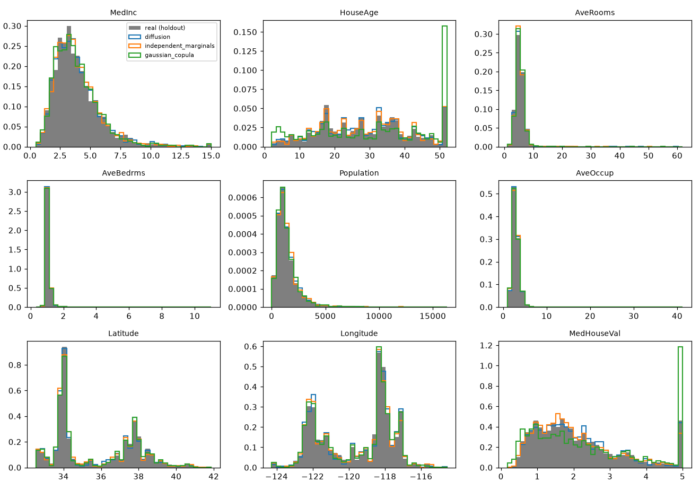
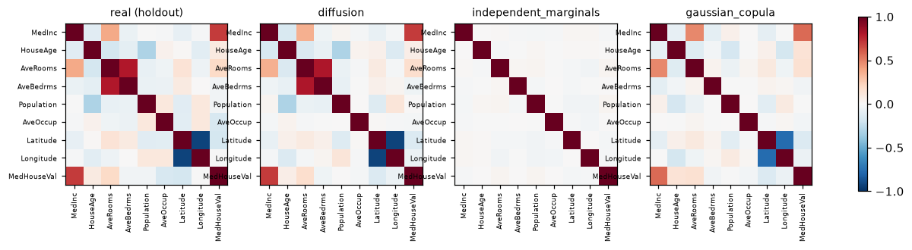
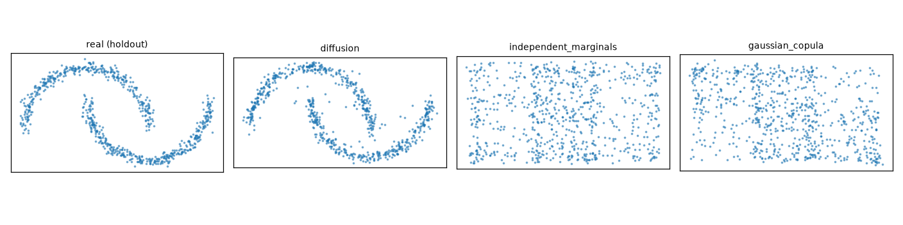

# dataDiffusion

Synthetic tabular data with a denoising diffusion model (DDPM / DDIM), evaluated **honestly**:
every score is measured on real rows the model never trained on and printed next to two simple
baselines, so you can see what diffusion actually buys you.

- Residual-MLP ε-predictor, cosine or linear noise schedule, EMA weights, early stopping.
- DDPM (ancestral) and DDIM (fast, η-controlled) samplers with x₀ clipping.
- Features and the target are generated **jointly**, so synthetic rows carry their own labels.
- Metrics: per-column KS and Wasserstein, correlation gap, C2ST (can a classifier tell real from
  synthetic?), TSTR (train on synthetic, test on real), DCR (is it copying training rows?).
- Baselines: independent marginals and a Gaussian copula.
- CPU-friendly, small dependency set (torch, numpy, scikit-learn); runs are local directories.

## Install

```bash
uv sync --extra dev        # or: pip install -e ".[plots]"
```

Python 3.11–3.12, torch 2.2.2 (also runs on Intel Macs).

## Use

```bash
# fast sanity check on the 2-D moons (figures show real vs synthetic point clouds)
uv run datadiffusion train --config configs/moons.toml          # prints runs/moons/<timestamp>
uv run datadiffusion evaluate runs/moons/<timestamp> --method ddpm

# California Housing (8 features + target)
uv run datadiffusion train --config configs/california.toml
uv run datadiffusion evaluate runs/california/<timestamp> --method ddpm
uv run datadiffusion sample runs/california/<timestamp> -n 10000 -o synthetic.csv

uv run datadiffusion baselines --dataset california             # baselines alone
```

`evaluate` writes `report.json`, `report.md`, `marginals.png` and `correlations.png` (plus
`scatter.png` for 2-D data) into the run directory. Every run directory also holds `config.json`,
`metrics.jsonl` (per-epoch losses and learning rate) and `model.pt` (config + weights; loads with
`torch.load(weights_only=True)`).

## Results (v3.0.0)

Seed 0, CPU (2014 MacBook Pro); reproduce with `scripts/final_runs.sh`. Configs and full reports: [`results/`](results/). Samplers: DDPM
(1000 ancestral steps, the default) and DDIM (100 steps, η = 0).

**California Housing** — 8 features + target, 14,448 training rows; best epoch 294 of 300.

| Metric | Diffusion (DDPM) | Diffusion (DDIM) | Independent marginals | Gaussian copula | Real holdout |
|---|---|---|---|---|---|
| KS, mean over columns (↓) | 0.023 | 0.027 | 0.024 | 0.045 | — |
| Wasserstein / IQR, mean (↓) | 0.083 | 0.524 | 0.064 | 0.138 | — |
| Correlation gap (↓) | **0.034** | 0.047 | 0.157 | 0.075 | — |
| C2ST AUC (0.5 = indistinguishable) | **0.581** | 0.604 | 0.972 | 0.908 | — |
| TSTR R² (↑; TRTR = 0.854) | **0.798** | 0.783 | −0.130 | 0.560 | 0.824 |
| DCR ratio (≈ 1 healthy, ≪ 1 copying) | 1.013 | 1.020 | 1.871 | 1.559 | 1.000 |

A gradient-boosting model trained only on diffusion samples reaches R² 0.80 on real test rows —
93% of training on the real data (0.854) and far above the copula (0.56) — while a classifier can
barely tell diffusion rows from real ones (AUC 0.58 vs 0.91 for the copula), and the samples sit no
closer to training rows than real unseen rows do (DCR ≈ 1). Independent marginals win the per-column
Wasserstein score, as they must (they resample each training column exactly), and lose everything
that involves more than one column. DDIM's larger mean Wasserstein is almost all one column —
`AveOccup`, whose tail runs to over 1,000 occupants per household: 4.21 IQRs off under DDIM vs 0.44
under DDPM, with every other column within about 2x. That tail sensitivity is why DDPM is the default.




**Two moons** — 3,500 training points; best epoch 141 (early stop at 181).



| Metric | Diffusion (DDPM) | Diffusion (DDIM) | Independent marginals | Gaussian copula |
|---|---|---|---|---|
| KS (↓) | 0.047 | 0.086 | 0.046 | 0.038 |
| Correlation gap (↓) | **0.022** | 0.019 | 0.525 | 0.133 |
| C2ST AUC (0.5 best) | **0.545** | 0.628 | 0.862 | 0.829 |
| DCR ratio | 0.974 | 1.058 | 7.129 | 6.090 |

## How it is evaluated

The data is split once (seeded) into **train 70% / holdout 15% / test 15%**. The model and the
quantile preprocessor only ever see *train*.

| Metric | Compared against | Reads as |
|---|---|---|
| KS statistic, Wasserstein-1 / IQR (per column, averaged) | holdout | marginal fidelity; 0 is identical |
| Correlation gap: mean \|Δ corr\| over column pairs | holdout | dependence structure; 0 is identical |
| C2ST AUC: gradient boosting telling real from synthetic | holdout | 0.5 = indistinguishable, 1 = trivially detectable |
| TSTR R²: model trained on synthetic (X, y), scored on real test | test | utility; compare with TRTR (trained on real train) |
| DCR ratio: median distance to nearest *training* row, synthetic ÷ holdout | train | ≈1 healthy; ≪1 means it is copying training rows |

KS p-values are deliberately not reported: with thousands of rows every difference is "significant".
The two baselines bracket the problem: **independent marginals** get every column right and all
dependence wrong; the **Gaussian copula** adds linear dependence. A generator is only interesting
where it beats the copula.

## Limitations

- Numeric columns only; categorical support is not implemented.
- Integer-valued columns (population, house age) come out as floats, e.g. a population of 1355.77;
  round them after sampling if you need integers.
- The quantile preprocessor maps back through the training quantiles, so synthetic values never
  leave each column's training range.
- DCR is a heuristic privacy check, not a differential-privacy guarantee.

## Project history

v1 and v2 (tags `v1.0`, `v2.0`) reported a composite score of ~0.92 that turned out to be inflated
(a mis-normalized correlation term) and a "TSTR" that labelled synthetic rows with a model trained on
real data. v3 replaces both with the protocol above; see [CHANGELOG.md](CHANGELOG.md).

## Docs

[docs/architecture.md](docs/architecture.md) — the math and the module map ·
[docs/api.md](docs/api.md) — Python API.

## License

MIT.
